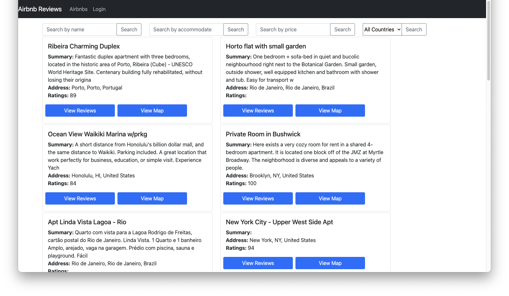
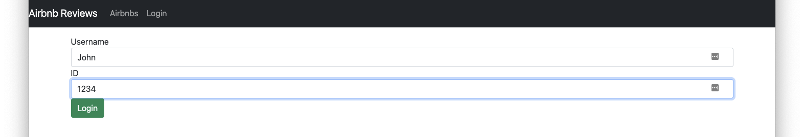
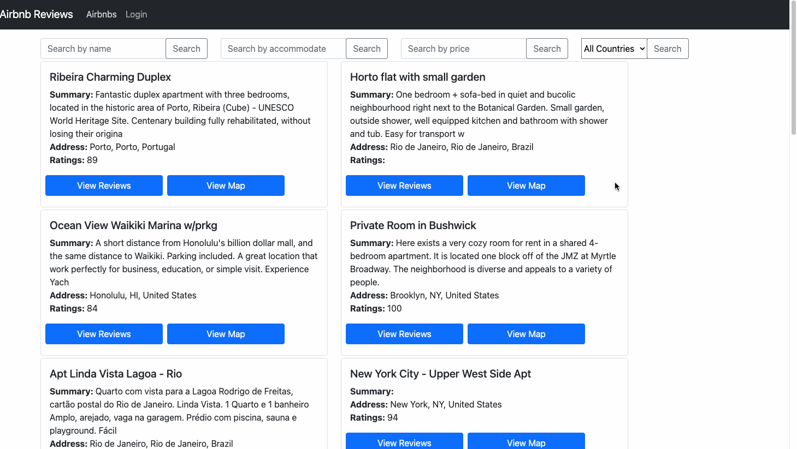
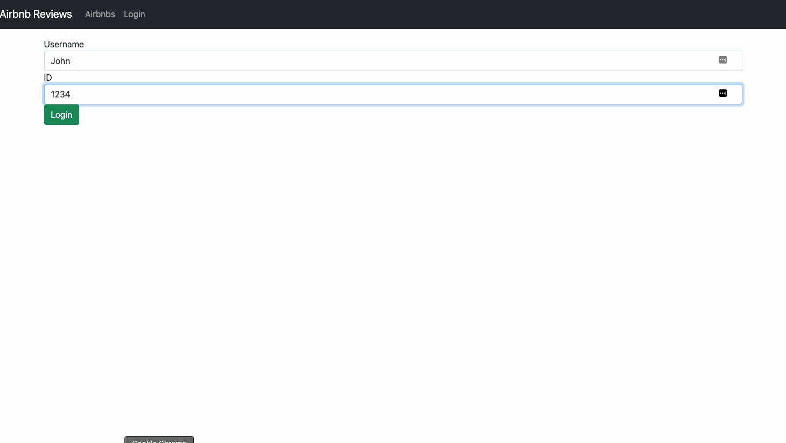

## Overview

This is a simple Airbnb review website using MERN Stack(MongoDB, Express, React, Node). On the main page, it lists all Airbnbs from the dataset, allowing users to use the different search functionalities to find the desired Airbnbs. For each Airbnb, it contains reviews from all of its customers, detailed information about the place, and external links to that Airbnb website. This website also implements a simple login system that allows users to add reviews, and they are only able to modify and delete their own reviews.

## Features

#### Search

* Name: find Airbnbs containing entered name
* Accommodate: find Airbnbs with the specified number
* Price: find Airbnbs below the entered price
* Country: find Airbnbs within the selected country.

#### Review

* Contains a detailed descriptions of the selected Airbnb
* A list of all reviews created by different users
* All reviews can be updated

#### Login

* A simple login system
* Users logged in are able to create reviews for Airbnbs
* Users logged in are able to modify and delete their own comments

#### View Map

* Open google map of the address of the Airbnb

#### View Website

* Link to the website of the Airbnb

## Demonstration

Ways of searching desired Airbnb
  

  
Login system and Review modification
  

## Dataset

Sample dataset provided by MongoDB.

## References

Inspired by youtube videos from **freeCodeCamp.org**
