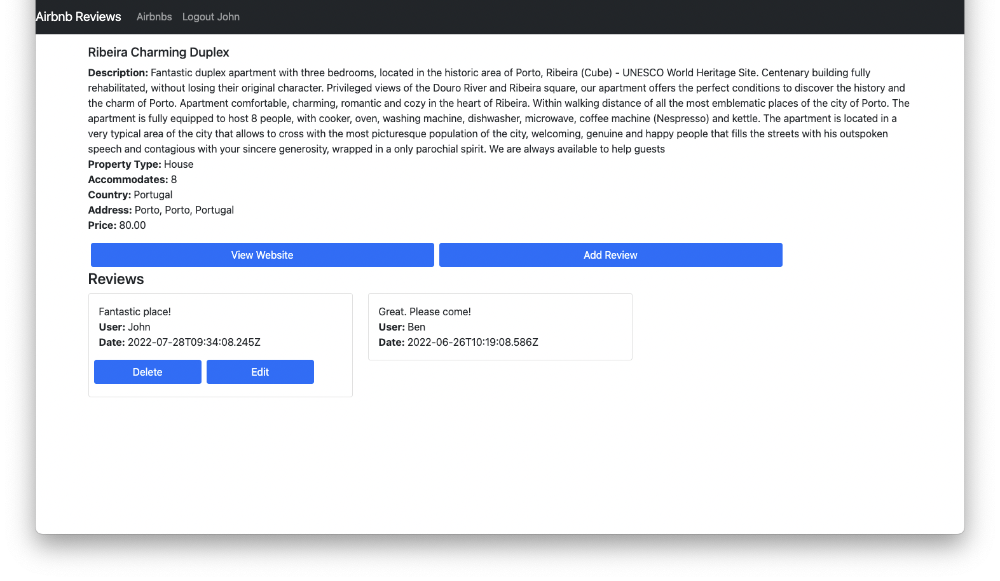

## Overview

This is a simple airbnb reviews website using MERN Stack(MongoDB, Express, React, Node).

## Features

#### Search

* Name: find airbnbs containing entered name
* Accommodate: find airbnbs with the specified number
* Price: find airbnbs below the entered price
* Country: find airbnbs within the selected country.

#### Review

* Contains a detailed descriptions of the selected airbnb
* A list of all reviews created by different users
* All reviews can be updated

#### Login

* A simple login system
* Users logged in are able to create reviews for airbnbs
* Users logged in are able to modify and delete their own comments

#### View Map

* Open google map of the address of the airbnb

#### View Website

* Link to the website of the airbnb

## Demonstration

Ways of searching desired airbnb
  

  
Review modification when logged in
  

## Dataset

Sample dateset provided by MongoDB.

## References

Inspired by youtube videos from **freeCodeCamp.org**
